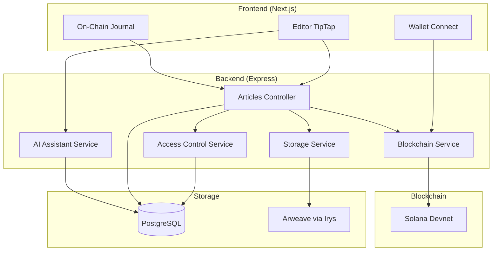
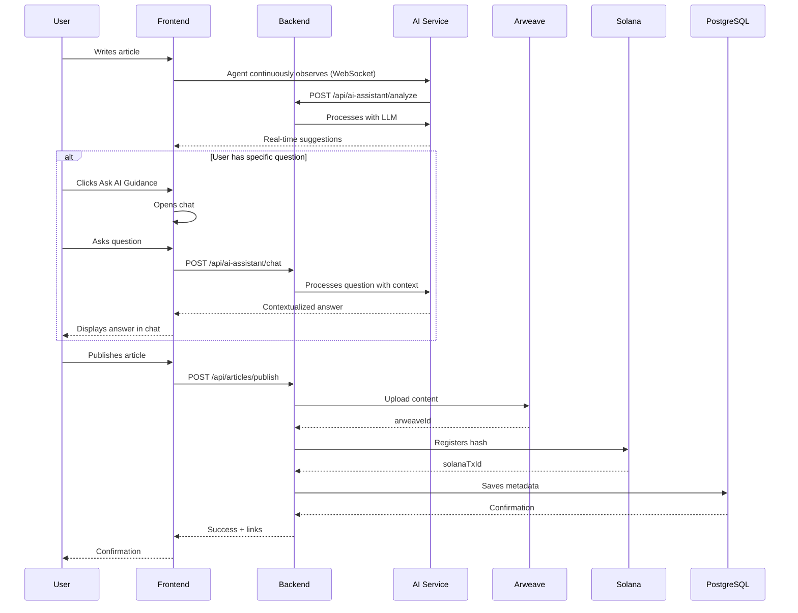
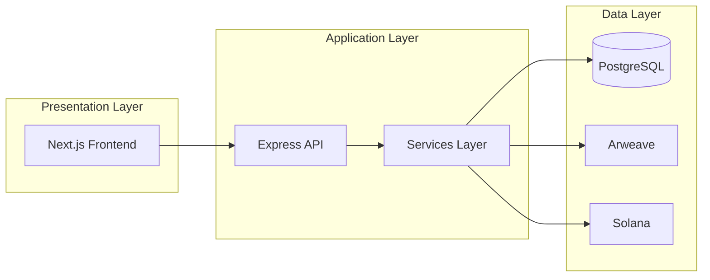
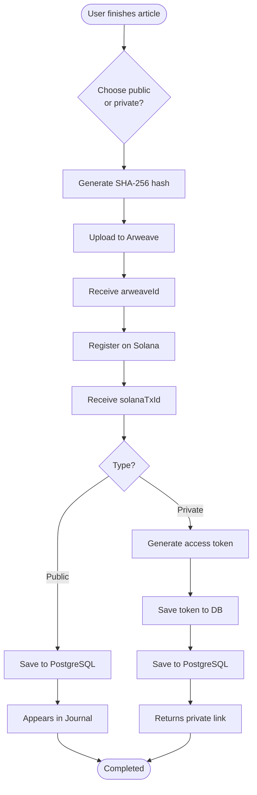

# Architecture Diagram - Aurora Scholar

> System architecture overview

## Architecture in Text/ASCII

```
┌─────────────────────────────────────────────────────────────────┐
│                        FRONTEND (Next.js)                        │
│  ┌─────────┐  ┌─────────┐  ┌─────────┐  ┌─────────────────────┐ │
│  │ Editor  │  │ Wallet  │  │ Journal │  │ Profile (future)    │ │
│  │ TipTap  │  │ Connect │  │ View    │  │                     │ │
│  └────┬────┘  └────┬────┘  └────┬────┘  └─────────────────────┘ │
└───────┼────────────┼───────────┼────────────────────────────────┘
        │            │           │
        ▼            ▼           ▼
┌─────────────────────────────────────────────────────────────────┐
│                        BACKEND (Express)                         │
│  ┌─────────────┐  ┌─────────────┐  ┌─────────────────────────┐  │
│  │ Articles    │  │ Storage     │  │ Blockchain              │  │
│  │ Controller  │  │ Service     │  │ Service                 │  │
│  └──────┬──────┘  └──────┬──────┘  └───────────┬─────────────┘  │
│  ┌─────────────┐  ┌─────────────┐  ┌─────────────────────────┐  │
│  │ AI          │  │ Access      │  │                         │  │
│  │ Assistant   │  │ Control     │  │                         │  │
│  │ Service     │  │ Service     │  │                         │  │
│  └──────┬──────┘  └──────┬──────┘  └─────────────────────────┘  │
└─────────┼────────────────┼─────────────────────┼────────────────┘
          │                │                     │
          ▼                ▼                     ▼
    ┌──────────┐    ┌──────────┐          ┌──────────┐
    │PostgreSQL│    │ Arweave  │          │  Solana  │
    │ (metadata│    │ (content)│          │(on-chain)│
    └──────────┘    └──────────┘          └──────────┘
```

## Mermaid Diagram - Component Architecture



## Data Flow Between Components



## Architecture Layers



## Main Components

### Frontend
- **Editor**: Writing interface with TipTap
- **Wallet Connect**: Integration with Solana wallets
- **Journal**: On-chain journal viewing

### Backend
- **Articles Controller**: Manages article CRUD
- **Storage Service**: Upload to Arweave via Irys
- **Blockchain Service**: Interaction with Solana
- **AI Assistant Service**: AI processing
- **Access Control Service**: Private access management

### Storage
- **PostgreSQL**: Metadata and cache
- **Arweave**: Permanent content

### Blockchain
- **Solana**: On-chain hash and metadata registration

## Complete Publication Flow



## Related Documentation

- [Complete Architecture](../ARCHITECTURE.md)
- [Use Cases](../USE_CASES.md)
- [MVP](../MVP.md)
