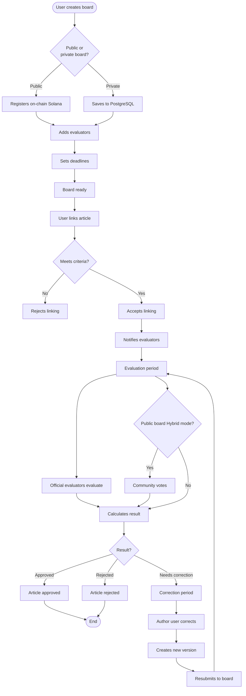
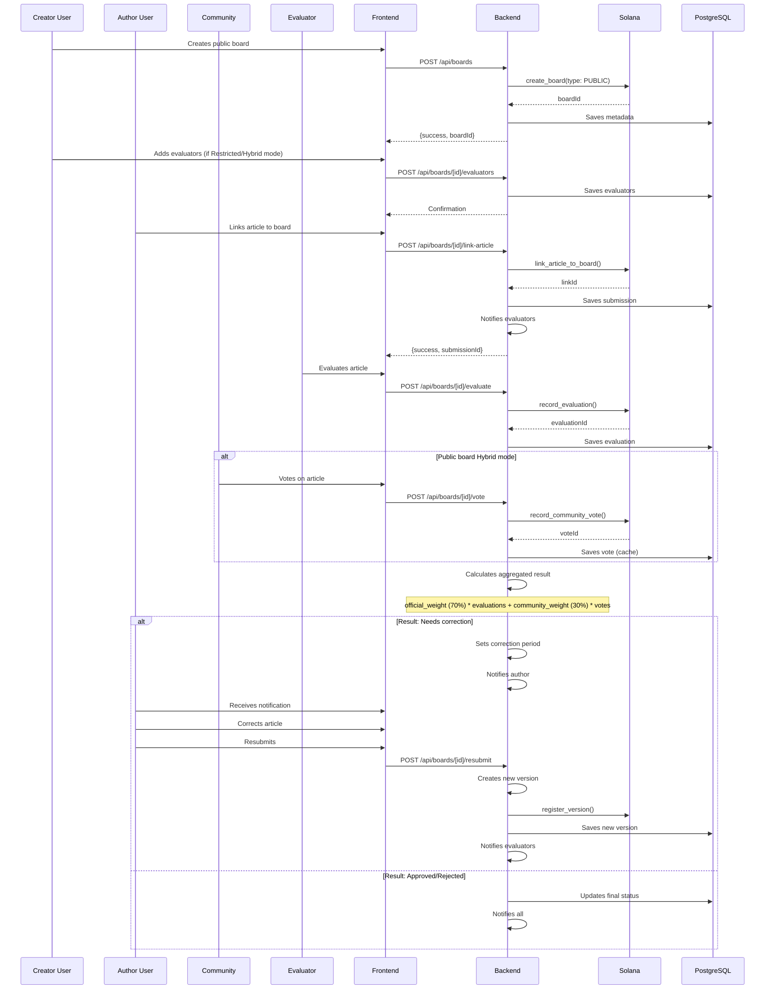
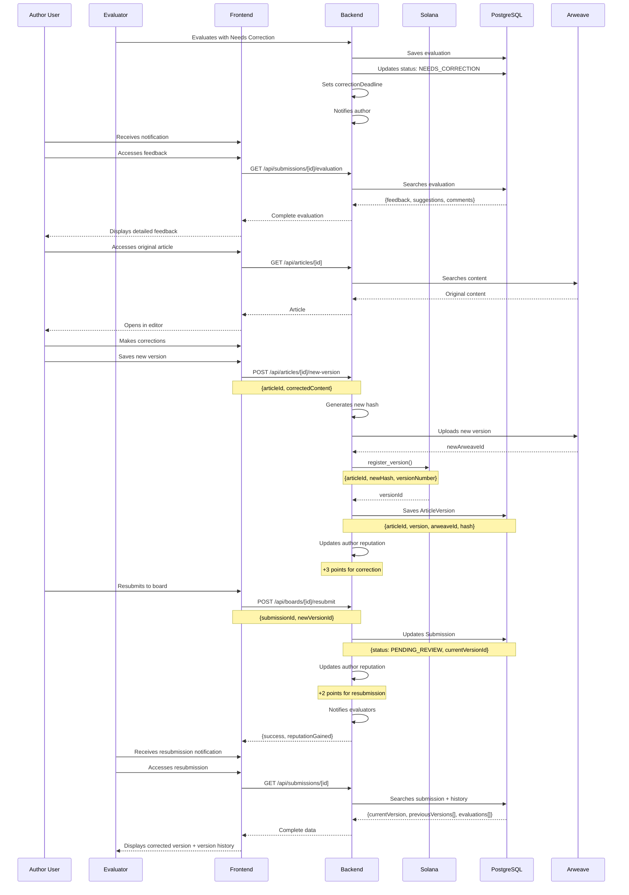
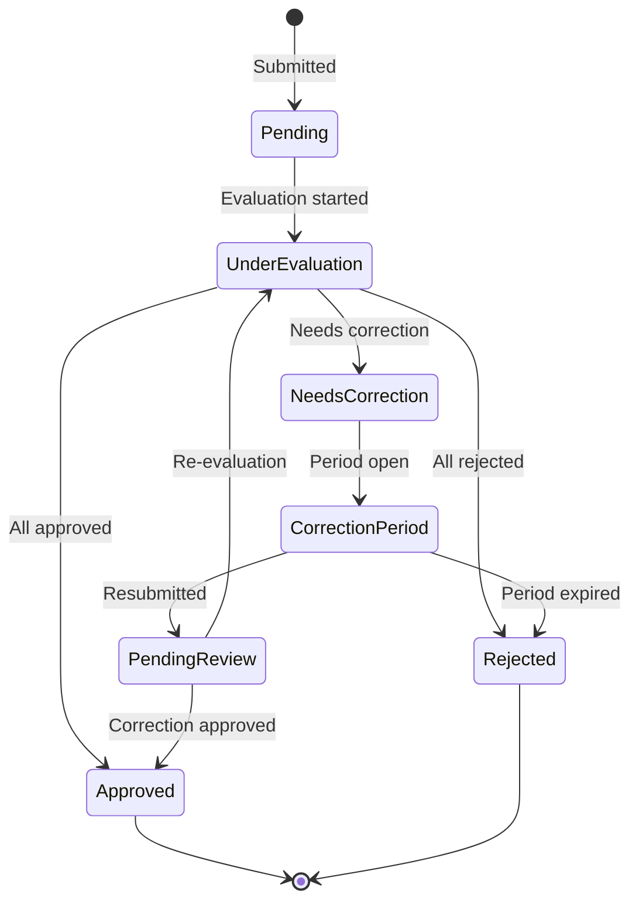
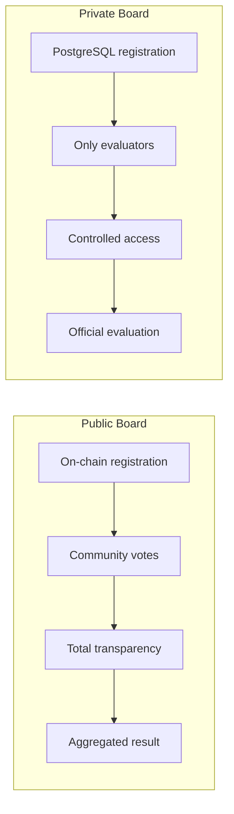

# Workflow - Evaluation Boards

> Detailed flows of the evaluation board system

## Main Flow: Board Creation and Evaluation

## Sequence Flow: Complete Public Board

## Correction Period Flow

## Submission States

## Comparison: Public Board vs Private Board

## Related Documentation

- [Use Cases](../USE_CASES.md) - UC09 to UC13
- [Roadmap](../ROADMAP.md) - Phase 2: Board System
- [Architecture](../ARCHITECTURE.md) - Section 8: Evaluation Boards
