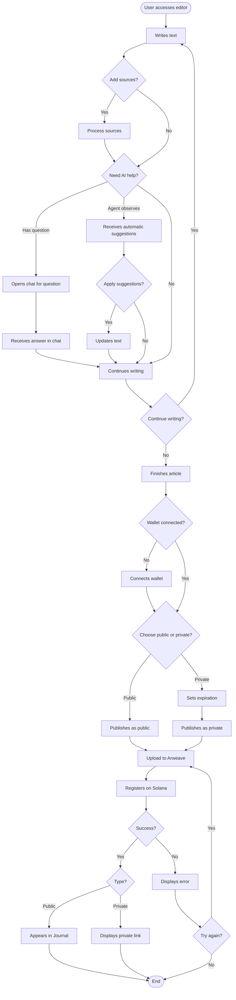
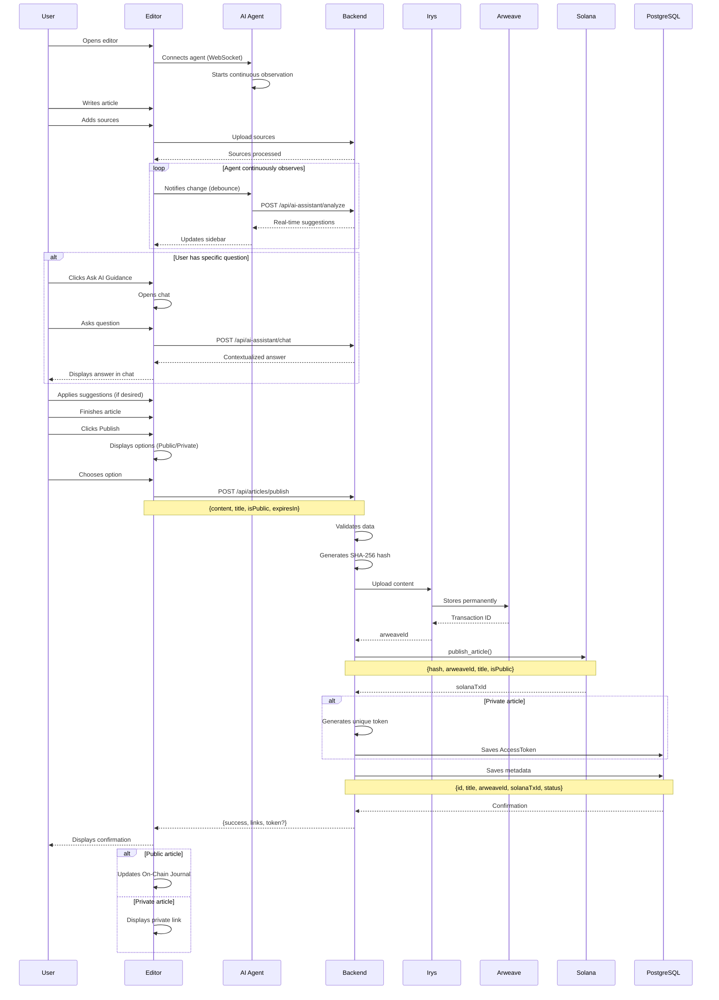
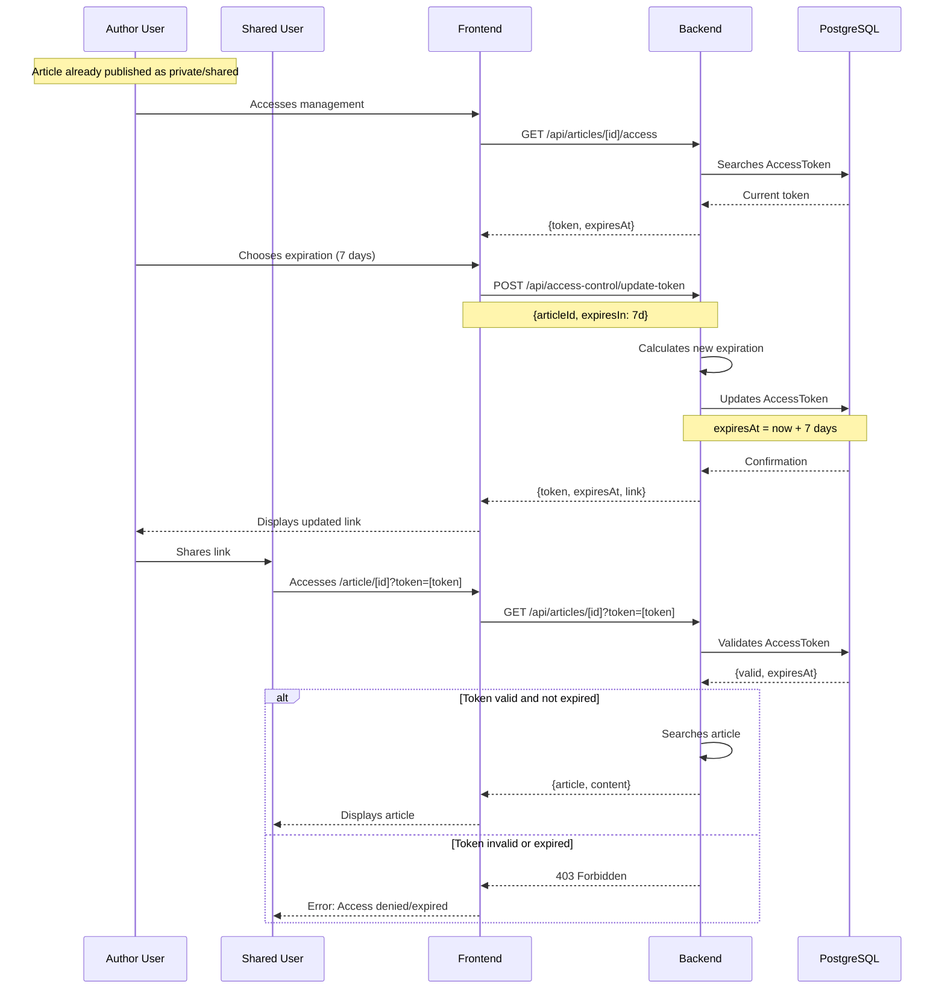
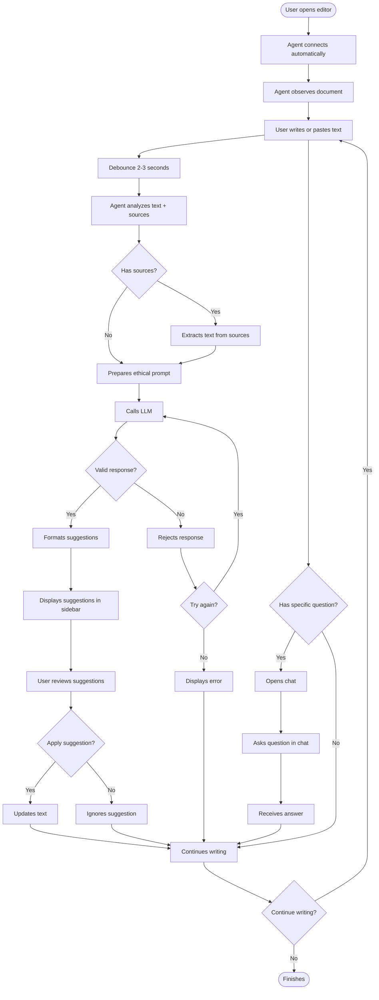
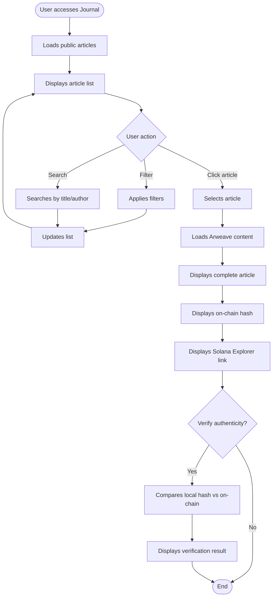
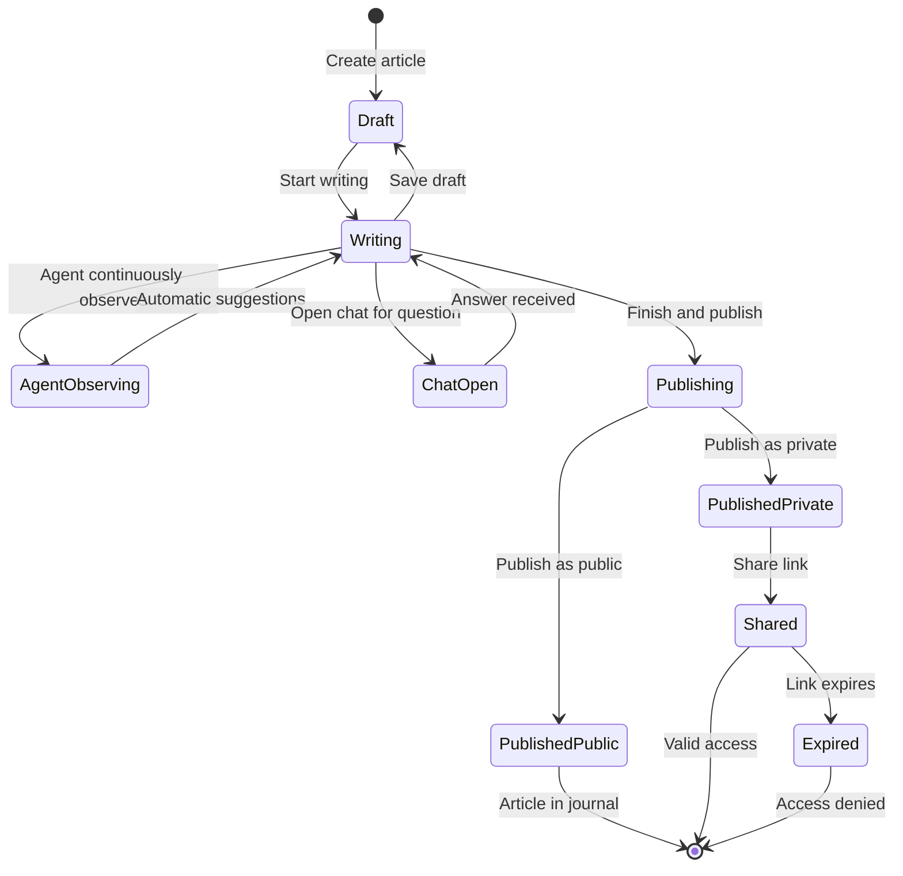

# Workflow - User Editor

> Detailed flows of user using the editor

## Main Flow: Write and Publish Article

## Sequence Flow: Complete Publication

## Temporary Access Flow

## AI Assistant Flow

## Journal Viewing Flow

## Article States

## Related Documentation

- [Use Cases](../USE_CASES.md) - Each case detailed
- [Architecture](../ARCHITECTURE.md) - Technical decisions
- [MVP](../MVP.md) - MVP features
