# Aurora Scholar - Use Cases

> Complete documentation of all application use cases with Mermaid diagrams

## Introduction

This document describes all main use cases of the Aurora Scholar platform. Each use case includes description, actors, preconditions, main flow, Mermaid diagram, and postconditions.

## Diagram Legend

- **Sequence Diagram:** Shows interactions between actors and system over time
- **Activity Diagram:** Shows flow of activities and decisions
- **Actors:** User (any), Author User, Evaluator User, Creator User, System, Community

## UC01: User writes article with always-active AI assistant

### Description
User uses the editor to write an academic article. An AI agent is always connected and observing the document, continuously evaluating as the user writes or pastes content. The agent provides real-time ethical guidance on structure, references, grammar, and authenticity.

### Actors
- User (article author)
- AI Agent (always active)

### Preconditions
- User is authenticated (wallet connected)
- Editor is open and functional
- AI agent is connected and active

### Main Flow

1. User opens editor
2. System automatically connects AI agent
3. Agent starts continuous document observation
4. User begins writing or pasting text
5. Agent detects text changes (2-3 second debounce)
6. Agent analyzes current text + loaded sources
7. Agent generates real-time suggestions:
   - Structural suggestions
   - Grammatical corrections
   - Authenticity alerts (if text seems too automated)
   - References based on sources
8. System displays suggestions in sidebar (continuous updates)
9. User reviews suggestions in real-time
10. User decides to apply or ignore suggestions
11. User continues writing (cycle repeats)
12. Agent continues observing and suggesting

### Mermaid Diagram

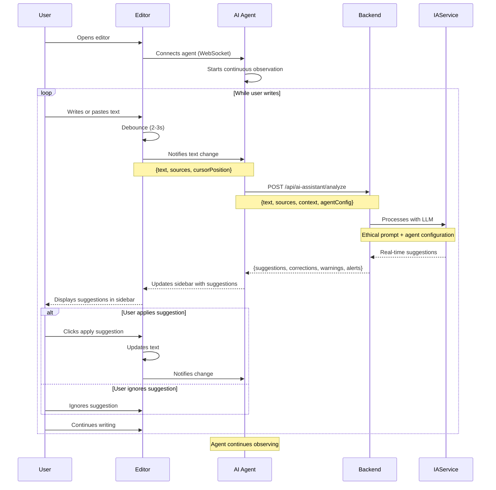

### Postconditions
- AI agent connected and continuously observing
- Text updated (if suggestions applied)
- Suggestions available in real-time in sidebar
- Interaction history with AI saved
- Authenticity alerts displayed when detected

### Alternative Flows

**FA01.1: Agent detects too automated text (AI-pasted)**
- Agent detects AI-generated text patterns
- Displays highlighted alert in sidebar
- Suggests rewriting with more criticality and own voice
- May suggest specific sources for consultation

**FA01.2: No sources loaded**
- Agent works only with provided text
- Suggestions are more generic
- Agent may suggest relevant sources to add

**FA01.3: User pastes large text**
- Agent detects paste
- Immediately analyzes pasted text
- Alerts about possible lack of authenticity
- Suggests rewriting or proper citation

**FA01.4: Multiple simultaneous suggestions**
- Agent prioritizes suggestions by relevance
- Displays most important first
- User can expand to see all

**FA01.5: User has specific question**
- User clicks "Ask AI Guidance"
- System opens interactive chat
- User asks specific question
- Agent responds based on document context (see UC15)

### Exceptions

**E01.1: Agent connection error**
- System attempts automatic reconnection
- Displays agent status indicator
- User can continue writing (text not lost)
- Suggestions cached until reconnection

**E01.2: Analysis timeout**
- System cancels analysis after 30s
- Agent continues observing
- Next analysis will be attempted on next debounce

**E01.3: Agent disconnected**
- System displays notification
- User can manually reconnect
- Editor continues functional without agent

---

## UC02: User uploads sources

### Description
User uploads files (PDFs, images, videos, audios) that will be used as sources for the AI assistant during writing.

### Actors
- User

### Preconditions
- User is in editor
- Editor supports file upload

### Main Flow

1. User clicks "Add Source"
2. System displays file selector
3. User selects one or more files
4. System validates types and sizes
5. System uploads files
6. System processes files (OCR, transcription, etc.)
7. System displays added sources in sidebar
8. Sources available for AI to consult

### Mermaid Diagram

```mermaid
activityDiagram
    start
    :User clicks Add Source;
    :System displays file selector;
    :User selects files;
    
    if Valid files? then
        :System validates types and sizes;
        if Validation OK? then
            :System uploads;
            :System processes files;
            
            if PDF type? then
                :Extracts text with OCR;
            else if Video/Audio type? then
                :Transcribes to text;
            else if Image type? then
                :Extracts text with OCR;
            end
            
            :System saves processed sources;
            :System displays in sidebar;
            :Sources available for AI;
            stop
        else
            :Displays validation error;
            stop
        end
    else
        :Displays invalid type error;
        stop
    end
```

### Postconditions
- Sources processed and available
- AI can consult sources in next requests
- Source list visible in sidebar

### Alternative Flows

**FA02.1: Multiple file upload**
- System processes in parallel
- Individual progress bar per file

**FA02.2: File too large**
- System suggests compression
- User can cancel or continue

### Exceptions

**E02.1: Processing error**
- System notifies error
- File remains in list but not processed
- User can try reprocessing

**E02.2: Unsupported file type**
- System rejects file
- Displays list of supported types

---

## UC03: User publishes public article

### Description
User finishes article and publishes as public, uploading to Arweave and on-chain registration on Solana. Article appears in On-Chain Journal.

### Actors
- User (article author)

### Preconditions
- User wrote article in editor
- Wallet is connected
- Article has title and minimum content

### Main Flow

1. User finishes article
2. User clicks "Publish"
3. System displays options: Public or Private
4. User chooses "Public"
5. System validates article data
6. System generates SHA-256 hash of content
7. System uploads to Arweave via Irys
8. System receives Arweave Transaction ID
9. System calls Solana smart contract
10. Smart contract registers hash, metadata and timestamp
11. System saves metadata to PostgreSQL
12. System returns confirmation with links
13. Article appears in On-Chain Journal

### Mermaid Diagram

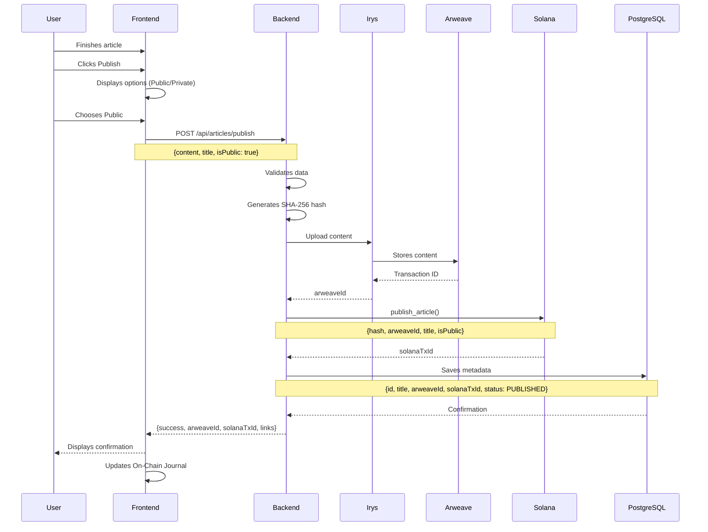

### Postconditions
- Article published and publicly visible
- Hash registered on-chain on Solana
- Content permanently stored on Arweave
- Article appears in On-Chain Journal
- Verification links available

### Alternative Flows

**FA03.1: Arweave upload error**
- System tries again (retry)
- If fails 3 times, notifies error
- User can try again

**FA03.2: Solana transaction error**
- System maintains upload on Arweave
- Notifies on-chain registration error
- User can try registering again

### Exceptions

**E03.1: Wallet disconnected**
- System requests connection
- Process pauses until connection

**E03.2: Insufficient balance for transaction**
- System notifies need for SOL
- User needs to add balance

---

## UC04: User publishes private article

### Description
User publishes article as private, generating access link that can be shared. Article does not appear in On-Chain Journal.

### Actors
- User (article author)

### Preconditions
- User wrote article in editor
- Wallet is connected
- Article has title and minimum content

### Main Flow

1. User finishes article
2. User clicks "Publish"
3. System displays options: Public or Private
4. User chooses "Private"
5. System validates article data
6. System generates SHA-256 hash of content
7. System uploads to Arweave via Irys
8. System receives Arweave Transaction ID
9. System calls Solana smart contract (is_public: false)
10. System generates unique access token
11. System saves AccessToken to PostgreSQL
12. System saves metadata to PostgreSQL
13. System returns private link
14. Article does NOT appear in On-Chain Journal

### Mermaid Diagram

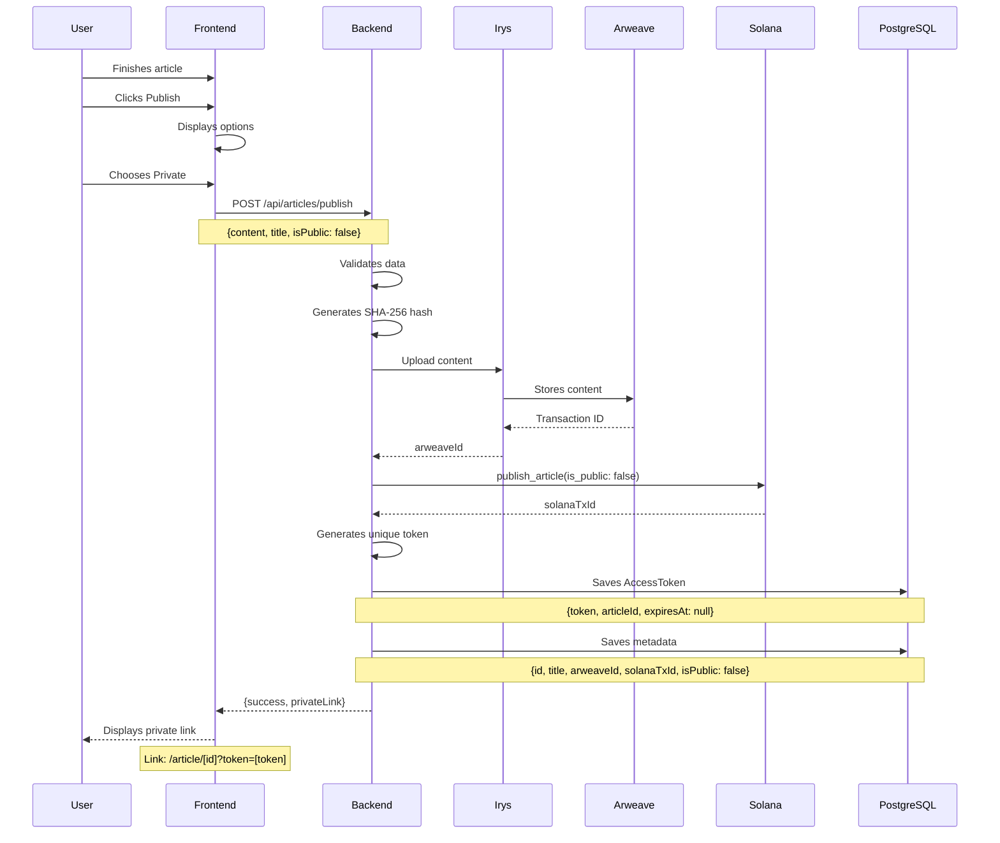

### Postconditions
- Article published as private
- Access token generated
- Private link available for sharing
- Article not visible in On-Chain Journal
- Hash registered on-chain

### Alternative Flows

**FA04.1: User sets expiration immediately**
- System includes expiresAt in AccessToken
- Link expires automatically

### Exceptions

**E04.1: Token generation error**
- System tries again
- If fails, notifies error

---

## UC05: User shares private article temporarily

### Description
User who published private article generates or renews access link with defined expiration (24h, 7d, 30d or unlimited) and shares with other users.

### Actors
- User (article author)
- Shared User (person who receives link)

### Preconditions
- Article already published as private or shared
- User has access to management page

### Main Flow

1. User accesses article management page
2. System displays sharing options
3. User chooses expiration (24h, 7d, 30d, unlimited)
4. System generates or renews token
5. System updates AccessToken in PostgreSQL
6. System returns updated link
7. User copies link
8. User shares link with another user
9. Shared user accesses link
10. System validates token and expiration
11. If valid: System displays article
12. If expired: System returns 403 error

### Mermaid Diagram

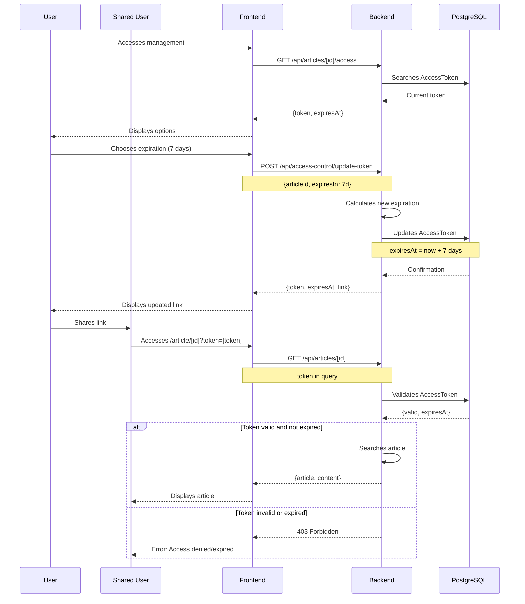

### Postconditions
- Token updated with new expiration
- Shareable link available
- Shared user can access while valid
- Access revoked after expiration

### Alternative Flows

**FA05.1: Renew existing token**
- System maintains same token
- Only updates expiration

**FA05.2: Generate new token**
- System invalidates previous token
- Generates new unique token

**FA05.3: Manually revoke access**
- User clicks Revoke access
- System sets expiresAt as now
- Link immediately invalid

### Exceptions

**E05.1: Token already expired**
- System allows renewal
- New period starts from now

---

## UC06: User views on-chain journal

### Description
Any user (authenticated or not) accesses the On-Chain Journal to view public articles published on the platform.

### Actors
- User (any person)

### Preconditions
- None (public access)

### Main Flow

1. User accesses On-Chain Journal page
2. System searches public articles in PostgreSQL
3. System returns article list
4. System displays articles with: title, author, date, hash
5. User can filter by date or author
6. User can search by title/author
7. User clicks on an article
8. System searches content from Arweave
9. System displays complete article
10. System displays link to verify hash on Solana Explorer

### Mermaid Diagram

```mermaid
activityDiagram
    start
    :User accesses On-Chain Journal;
    :System searches public articles;
    
    if Articles found? then
        :System displays list;
        :User views articles;
        
        if User filters? then
            :Applies filters (date/author);
            :Updates list;
        end
        
        if User searches? then
            :Searches by title/author;
            :Updates list;
        end
        
        if User clicks article? then
            :System searches Arweave content;
            :System displays complete article;
            :System displays Solana Explorer link;
            stop
        else
            :User continues browsing;
            stop
        end
    else
        :Displays message No articles found;
        stop
    end
```

### Postconditions
- Article list displayed
- Selected article viewed
- Verification links available

### Alternative Flows

**FA06.1: Pagination**
- System displays 20 articles per page
- User can navigate pages

**FA06.2: Sorting**
- By date (newest first)
- By author (alphabetical)
- By title (alphabetical)

### Exceptions

**E06.1: Error searching Arweave content**
- System displays error message
- User can try again
- Metadata still visible

---

## UC07: Article authenticity verification

### Description
User verifies if article content corresponds to hash registered on-chain on Solana, ensuring authenticity and integrity.

### Actors
- User
- System

### Preconditions
- Article published (public or private with access)
- Hash registered on Solana

### Main Flow

1. User accesses article
2. User clicks "Verify Authenticity"
3. System searches hash on Solana using solanaTxId
4. System recalculates SHA-256 hash of current content
5. System compares local hash with on-chain hash
6. If equal: System confirms authenticity
7. If different: System alerts possible alteration
8. System displays verification result

### Mermaid Diagram

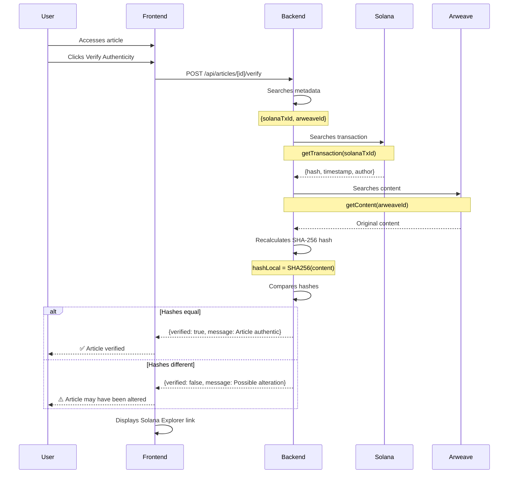

### Postconditions
- Verification result displayed
- Link to Solana Explorer available
- Confidence in authenticity (if verified)

### Alternative Flows

**FA07.1: Automatic verification**
- System automatically verifies when loading article
- Displays verification badge

### Exceptions

**E07.1: Error searching Solana**
- System notifies connection error
- User can try again

**E07.2: Transaction not found**
- System alerts possible problem
- Suggests manually verifying solanaTxId

---

## UC08: AI agent processes continuous analysis

### Description
Always-active AI agent processes document changes in real-time, analyzing text, loaded sources, and agent configuration. Returns ethical suggestions without writing complete text, continuously observing as user writes or pastes content.

### Actors
- AI Agent (always active)
- System (Editor + Backend)

### Preconditions
- AI agent is connected to editor
- Editor detects text changes (debounce)
- Text and/or sources available
- Agent configuration loaded (default or custom)

### Main Flow

1. Editor detects text change (after 2-3s debounce)
2. Editor sends current text + sources + agent configuration to backend
3. Backend processes sources (extracts text from PDFs, transcribes videos/audios, OCR images)
4. Backend prepares ethical prompt based on agent configuration:
   - Default agent: generic academic prompt
   - Custom agent: specific prompt (based on author, source, or user data)
5. Backend sends to LLM with complete context
6. LLM analyzes and returns real-time suggestions
7. Backend validates response (ensures it didn't write complete text)
8. Backend detects authenticity (if text seems too automated)
9. Backend returns suggestions, corrections, references, alerts
10. Agent updates editor sidebar with suggestions
11. Process repeats continuously while user writes

### Mermaid Diagram

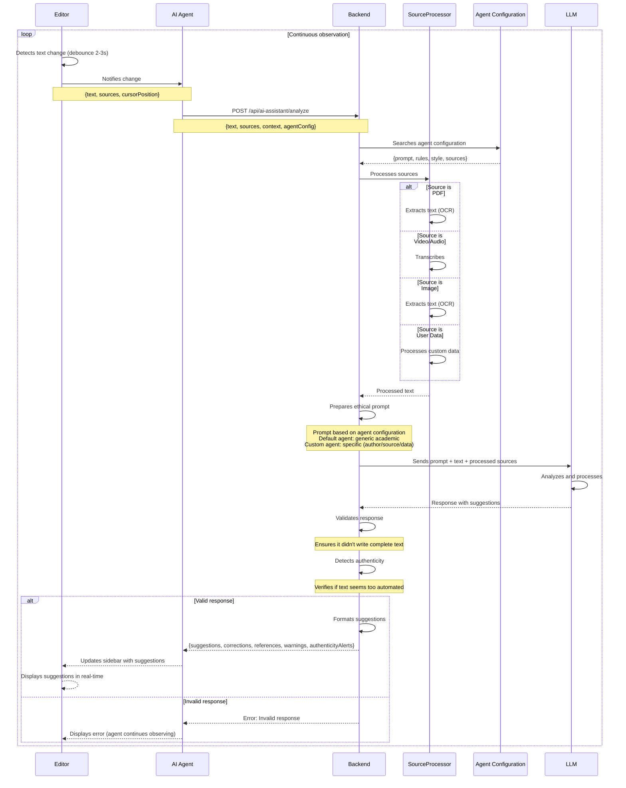

### Postconditions
- AI agent continues observing document
- Suggestions available in real-time in sidebar
- Interaction history saved
- Sources processed and indexed
- Authenticity alerts displayed when detected

### Alternative Flows

**FA08.1: No sources provided**
- Agent works only with text
- More generic suggestions
- May suggest relevant sources to add

**FA08.2: Multiple sources**
- Agent analyzes all sources
- Suggestions based on source set
- Prioritizes sources more relevant to context

**FA08.3: Custom agent active**
- If user configured specific agent
- Prompt and rules based on agent configuration
- Suggestions follow agent's style and knowledge

**FA08.4: Pasted text detected**
- Agent detects paste pattern
- Immediately analyzes pasted text
- Alerts about possible lack of authenticity

### Exceptions

**E08.1: LLM returns complete text**
- System rejects response
- Requests new response with reinforced prompt
- Agent continues observing (doesn't block)

**E08.2: Source processing error**
- System continues without problematic sources
- Notifies which sources failed

**E08.3: LLM request timeout**
- System cancels after 30s
- Notifies user
- Allows trying again

---

## UC09: User creates evaluation board

### Description
Any connected user (wallet) can create an evaluation board. The creator defines settings, board type, evaluation mode, and who can participate.

### Actors
- User (any person with connected wallet)

### Preconditions
- User is authenticated (wallet connected)
- Any user can create boards (no role restriction)

### Main Flow

1. User accesses board management page
2. User clicks "Create New Board"
3. System displays creation form
4. User fills:
   - Board name
   - Description
   - Type: Public (on-chain) or Private (PostgreSQL)
   - Evaluation mode:
     - **Open**: Any connected user can evaluate
     - **Restricted**: Only evaluators added by creator
     - **Hybrid**: Official evaluators + community can vote
   - Submission deadline
   - Evaluation deadline
   - Correction period (optional)
5. If Restricted or Hybrid mode: User adds evaluators (by wallet)
6. System validates data and evaluators
7. System registers board:
   - If public: on-chain on Solana
   - If private: in PostgreSQL
8. System generates access link for board
9. System notifies evaluators (if Restricted/Hybrid mode)
10. Creator receives reputation points (+15 public, +10 private)

### Mermaid Diagram

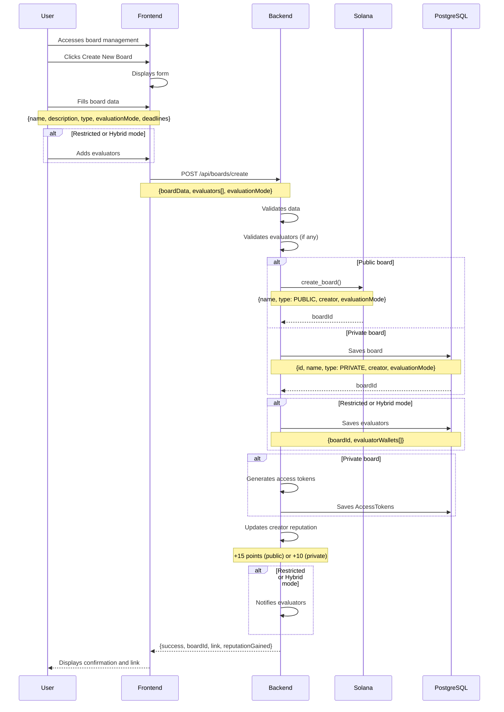

### Postconditions
- Board created and registered (on-chain or PostgreSQL)
- Evaluators added (if Restricted/Hybrid mode)
- Access link generated
- Board available to receive linked articles
- Creator receives reputation points

### Alternative Flows

**FA09.1: Public board with Open mode**
- On-chain registration on Solana
- Anyone can view
- Any connected user can evaluate
- Total transparency

**FA09.2: Public board with Hybrid mode**
- On-chain registration on Solana
- Official evaluators evaluate (higher weight)
- Community can vote (lower weight)
- Aggregated result calculated

**FA09.3: Add evaluators later**
- Creator can add/remove evaluators
- Only in boards with Restricted or Hybrid mode
- System updates permissions

**FA09.4: Private board**
- Stored in PostgreSQL
- Access controlled by tokens
- Only participants can see

### Exceptions

**E09.1: Invalid evaluator**
- System rejects invalid wallet
- User can correct and try again

**E09.2: On-chain registration error**
- System maintains board in PostgreSQL
- Notifies error
- User can try registering again

**E09.3: Open mode without evaluators**
- System allows creating board without evaluators
- Any user can evaluate

---

## UC10: User links article to board

### Description
Author of published article can link their article to one or more boards to receive evaluations. Article can be globally public, private, shared, or linked only to boards.

### Actors
- User (article author)
- Board (System)

### Preconditions
- Article already published (any visibility: public, private, shared)
- Board exists and is open for linking
- User is article author
- If private board: user has access (token or was added)

### Main Flow

1. User (author) accesses board page or their articles page
2. System displays board information and already linked articles
3. User chooses article to link
4. System validates:
   - User is article author
   - Article is published (not DRAFT)
   - Board is open for linking
5. System creates article-board link (ArticleBoardLink)
6. If private/shared article and private board:
   - System generates access tokens for board evaluators
7. If public board: on-chain registration (optional)
8. System creates Submission (status: PENDING)
9. System notifies evaluators (if Restricted/Hybrid mode)
10. Article appears in board's article list
11. User receives confirmation and reputation points (+2 points)

### Mermaid Diagram

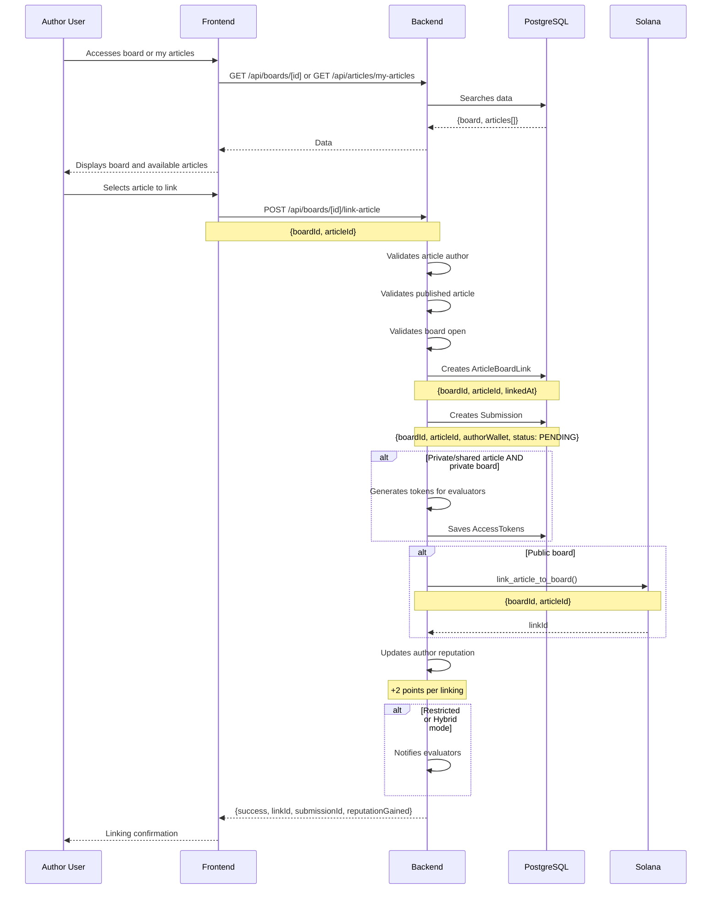

### Postconditions
- Article linked to board
- Link registered (ArticleBoardLink)
- Submission created (status: PENDING)
- Access tokens generated (if necessary)
- Evaluators notified (if Restricted/Hybrid mode)
- Author receives reputation points

### Alternative Flows

**FA10.1: Article already linked to board**
- System detects duplicate link
- Displays informative message
- Allows viewing existing link

**FA10.2: Board closed for linking**
- System blocks new linking
- Displays closing date
- User can view previous links

**FA10.3: Public article linked to public board**
- Article continues globally visible
- Also appears in board
- Can receive board evaluations + community votes

**FA10.4: Private article linked to private board**
- Article accessible only to board participants
- Tokens automatically generated for evaluators
- Evaluation happens within board

**FA10.5: Multiple links**
- Article can be linked to multiple boards
- Each board has its own evaluation
- Independent results

### Exceptions

**E10.1: User is not article author**
- System blocks linking
- Returns 403 Forbidden error

**E10.2: Article not published (DRAFT status)**
- System blocks linking
- Requests publication first

**E10.3: Private board without access**
- System requests access token
- User needs to be added as evaluator or have token

---

## UC11: User evaluates article in board

### Description
Connected user evaluates article linked to a board. Permission to evaluate depends on board mode: Open (any user), Restricted (only official evaluators), or Hybrid (officials + community votes).

### Actors
- User (any connected person, depending on board mode)
- Board (System)

### Preconditions
- Article was linked to board
- Evaluation period is open
- User has permission to evaluate:
  - **Open Mode**: Any connected user
  - **Restricted Mode**: Only official evaluators added by creator
  - **Hybrid Mode**: Official evaluators evaluate; community can vote (UC12)

### Main Flow

1. User accesses board
2. System verifies evaluation permission (based on board mode)
3. System displays list of linked articles available for evaluation
4. User selects article to evaluate
5. System verifies article access:
   - If public: access granted
   - If private/shared: verifies access token
6. System displays complete article
7. User fills evaluation:
   - Score (optional) or approval/rejection
   - Comments and feedback
   - Correction suggestions
8. User submits evaluation
9. System registers evaluation (on-chain if public board, PostgreSQL if private)
10. System updates evaluator reputation (+5 points)
11. System updates article status in board
12. If all official evaluators evaluated (Restricted/Hybrid mode): System calculates final result
13. Article author receives evaluation notification

### Mermaid Diagram

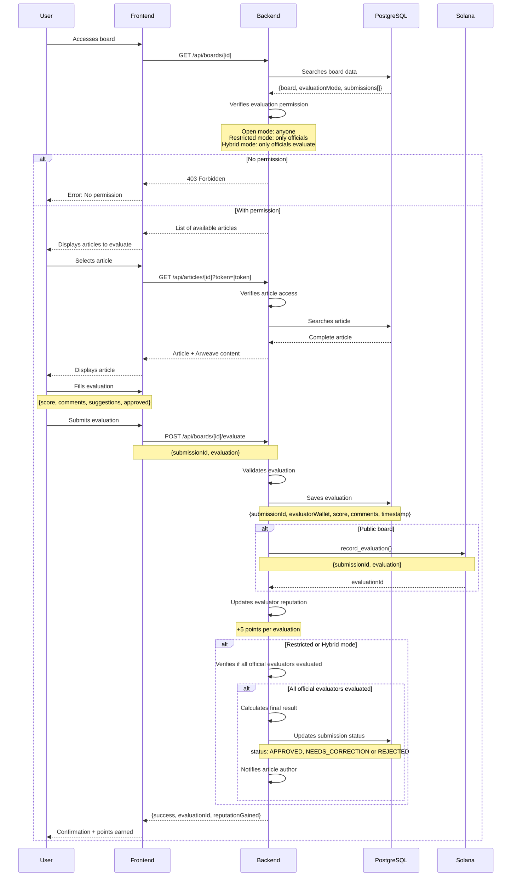

### Postconditions
- Evaluation registered (on-chain or PostgreSQL)
- Evaluator reputation updated (+5 points)
- Article status updated (if all evaluated)
- Article author notified (if all evaluated)
- Final result calculated (if applicable)

### Alternative Flows

**FA11.1: Article needs correction**
- User marks "Needs Correction"
- System sets correction period
- Author can correct and resubmit (UC13)

**FA11.2: Partial evaluation**
- User can save draft
- Continues evaluation later
- Submits when complete

**FA11.3: Open mode - multiple evaluations**
- Any user can evaluate
- System aggregates all evaluations
- Average or consensus calculated

### Exceptions

**E11.1: Evaluation period expired**
- System blocks new evaluations
- User can view previous evaluations

**E11.2: Unauthorized user (Restricted mode)**
- System verifies if user is official evaluator
- Returns 403 error if not authorized

**E11.3: Private article without token**
- System blocks access
- Requests valid access token

---

## UC12: Community votes in public board (Hybrid mode)

### Description
In public boards with Hybrid mode, besides official evaluators who evaluate in detail, any connected user can vote (approve/reject) on articles. System calculates aggregated result considering both weights.

### Actors
- User (any connected person)
- Board (System)

### Preconditions
- Board is public
- Board is in Hybrid mode (doesn't work in Open or Restricted mode)
- Article was linked to board
- User is authenticated (wallet connected)

### Main Flow

1. User accesses public board
2. System verifies board is in Hybrid mode
3. System displays linked articles
4. User selects article
5. System displays complete article
6. User reads article
7. User votes: Approve, Reject, or Abstain
8. System verifies if user already voted (one vote per wallet)
9. System registers vote on-chain
10. System updates vote count
11. System calculates aggregated result considering:
    - Community votes (30% weight)
    - Official evaluations (70% weight)
12. System updates voter reputation (+1 point)
13. System displays updated aggregated result

### Mermaid Diagram

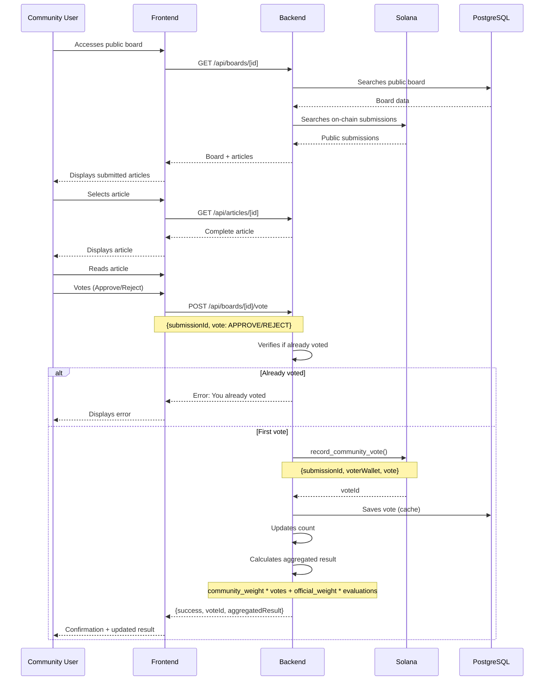

### Postconditions
- Vote registered on-chain
- Count updated
- Aggregated result recalculated
- Voter reputation updated (+1 point)
- Article cannot be voted again by same user

### Alternative Flows

**FA12.1: Vote can be changed**
- User can change vote before closing
- System updates previous vote on-chain
- Only last vote counts

**FA12.2: Weight system**
- Community votes: 30% weight
- Official evaluations: 70% weight
- Final result: weighted average

**FA12.3: Public board Open mode**
- No community voting (only evaluations)
- Any user can evaluate directly

### Exceptions

**E12.1: Board is not public or not in Hybrid mode**
- System blocks community voting
- Only official evaluators can evaluate (Restricted mode)
- Or anyone can evaluate (Open mode)

**E12.2: Voting period expired**
- System blocks new votes
- Displays final result

---

## UC13: Correction period after evaluation

### Description
After evaluation indicating need for correction, article author has defined period to correct and create new version. Corrected article maintains version history and can be re-evaluated in same board.

### Actors
- User (article author)
- Board (System)

### Preconditions
- Article was evaluated in a board
- Evaluation indicates need for correction (status: NEEDS_CORRECTION)
- Correction period is open (not expired)
- User is article author

### Main Flow

1. Author receives evaluation notification with feedback
2. Author accesses evaluation in board
3. System displays evaluators' feedback and suggestions
4. Author accesses original article
5. Author makes corrections in editor
6. Author saves new article version
7. System creates ArticleVersion (maintains history)
8. System registers new version on-chain (if public board)
9. Author resubmits corrected version to same board
10. System updates Submission with new version
11. System notifies evaluators of resubmission
12. Evaluators can re-evaluate new version
13. Author receives reputation points (+3 correction, +2 resubmission)

### Mermaid Diagram

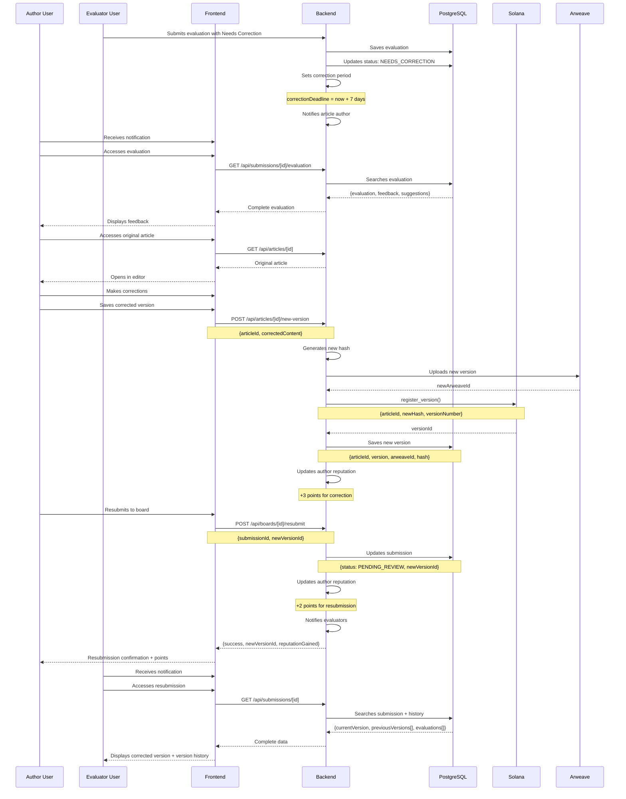

### Postconditions
- New article version created (ArticleVersion)
- Version history maintained
- Article resubmitted to board (status: PENDING_REVIEW)
- Evaluators notified
- Author reputation updated (+3 correction, +2 resubmission)

### Alternative Flows

**FA13.1: Correction period expired**
- System blocks resubmission
- Author can request extension from board creator
- Board creator can approve extension

**FA13.2: Multiple corrections**
- Author can correct multiple times
- Each correction creates new version
- Complete history maintained
- Each correction generates points (+3)

**FA13.3: Correction approved directly**
- If correction addresses feedback
- Evaluator can approve directly
- Doesn't need complete new round
- Status changes to APPROVED

### Exceptions

**E13.1: Original article not found**
- System alerts error
- Author can contact support

**E13.2: Error creating new version**
- System maintains previous version
- Notifies error
- Author can try again

**E13.3: User is not article author**
- System blocks correction
- Returns 403 Forbidden error

---

## UC14: User configures custom agent (Phase 2)

### Description
User can configure specific AI agents based on authors, specific sources, or own data. Each agent has its own style, rules, and knowledge base.

### Actors
- User
- Agent System

### Preconditions
- User is authenticated
- Custom agents feature is enabled (Phase 2)
- User has permission to create agents (may be based on reputation)

### Main Flow

1. User accesses agent settings
2. User clicks "Create New Agent"
3. System displays configuration options:
   - **Author-Based**: Searches information about author on internet (e.g., "Paulo Freire Agent", "Foucault Agent")
   - **Source-Based**: Uses specific source loaded by user
   - **Data-Based**: Uses dataset or user's own knowledge
4. User chooses agent type
5. If author-based:
   - System searches information about author on internet
   - System creates prompt based on author's style and thinking
6. If source-based:
   - User selects already loaded source
   - System uses only that source as knowledge base
7. If data-based:
   - User uploads dataset or knowledge
   - System processes and incorporates into agent
8. User configures additional rules:
   - Suggested writing style
   - Tone (formal, informal, critical)
   - Knowledge areas
   - Ethical limits
9. System saves agent configuration
10. Agent available for use in editor
11. User can select agent when opening editor

### Mermaid Diagram

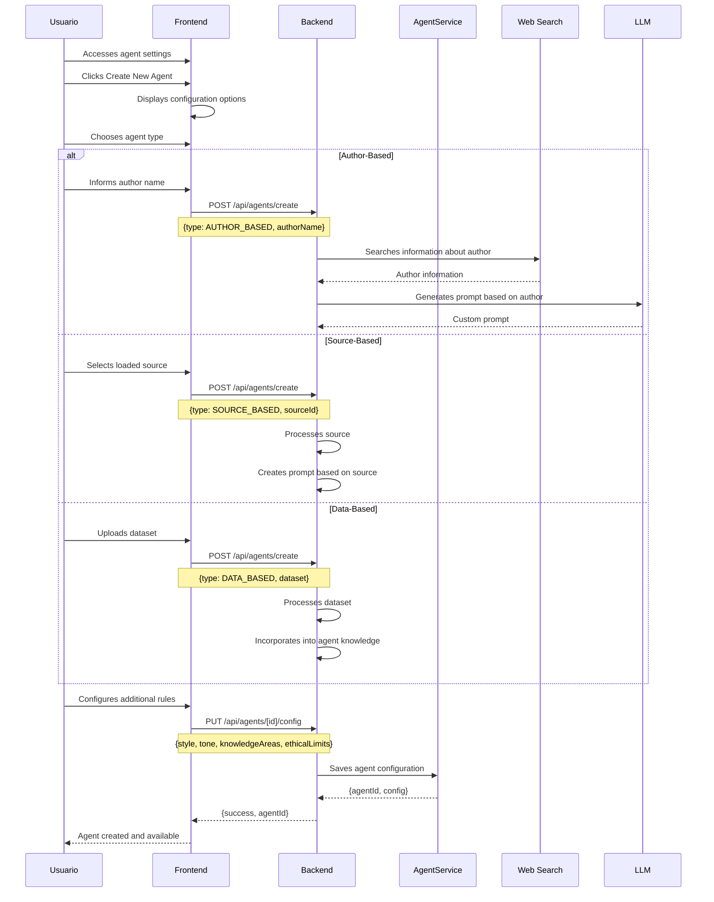

### Postconditions
- Custom agent created and saved
- Agent available for selection in editor
- Agent configuration stored
- Agent can be used in multiple documents

### Alternative Flows

**FA14.1: Agent based on existing author**
- System verifies if agent already exists for author
- Can reuse or create new
- User can further customize

**FA14.2: Multiple active agents**
- User can have multiple agents configured
- Can switch between agents in editor
- Each agent observes document independently

**FA14.3: Share agent**
- User can share agent with other users
- Others can use or customize
- Public agents can be discovered

### Exceptions

**E14.1: Author not found on internet**
- System notifies that information not found
- User can provide information manually
- Or choose another agent type

**E14.2: Invalid or corrupted source**
- System rejects source
- User needs to load valid source first

**E14.3: Dataset too large**
- System limits dataset size
- Suggests processing in parts
- Or use source instead of complete dataset

---

## UC15: User asks specific question via chat

### Description
When user has a specific question about text, structure, methodology, or concepts, can click "Ask AI Guidance" to open an interactive chat. Agent responds based on current document context, loaded sources, and agent configuration.

### Actors
- User (article author)
- AI Agent (via chat)

### Preconditions
- User is in editor
- Editor has text (even if partial)
- AI agent is available
- Chat can be opened at any time

### Main Flow

1. User is writing and has a specific question
2. User clicks "Ask AI Guidance"
3. System opens chat panel next to editor
4. User types specific question:
   - About text structure
   - About concepts or methodology
   - About references or sources
   - About how to improve a specific section
   - About academic standards
5. System sends question + document context to backend:
   - Complete current text
   - Cursor position (question context)
   - Loaded sources
   - Conversation history (if any)
   - Agent configuration
6. Backend processes with LLM
7. Agent generates response based on context
8. System displays response in chat
9. User can ask follow-up questions
10. Conversation history maintained during session
11. User can close chat and continue writing

### Mermaid Diagram

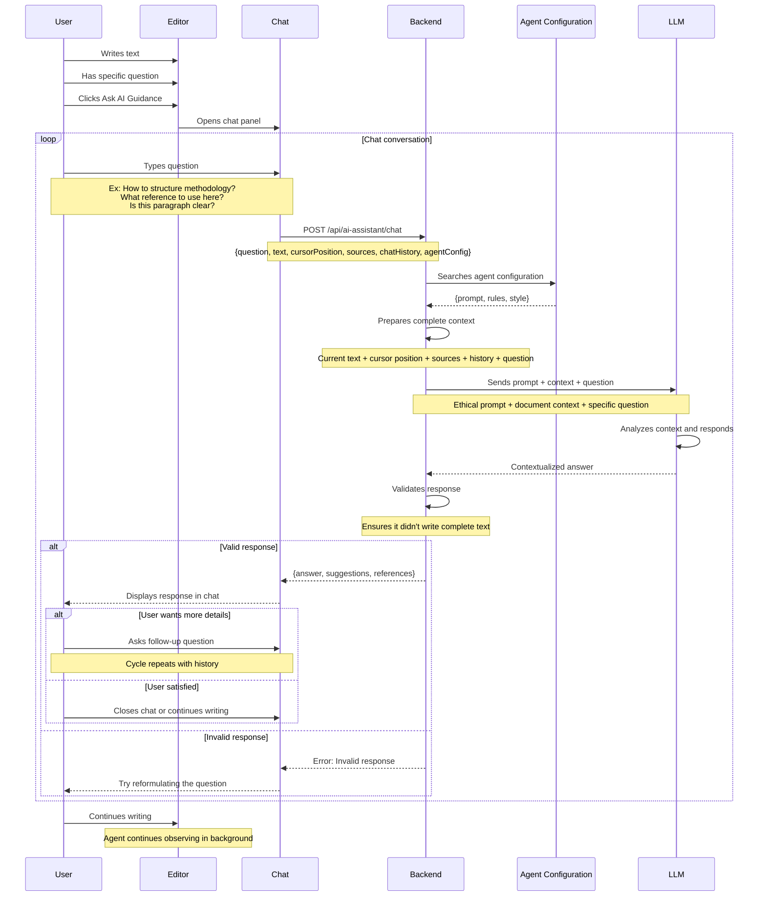

### Postconditions
- Chat open and functional
- Response displayed to user
- Conversation history maintained
- User can continue conversation or close chat
- Agent continues observing document in background

### Alternative Flows

**FA15.1: Question about specific section**
- User selects text before opening chat
- System includes selected text as context
- Agent responds specifically about selection

**FA15.2: Question about source**
- User asks about a loaded source
- Agent searches information in source
- Responds based exclusively on source

**FA15.3: Question about structure**
- User asks how to structure a section
- Agent suggests structure based on academic standards
- May suggest examples based on sources

**FA15.4: Multiple questions in sequence**
- Conversation history is maintained
- Agent has context from previous questions
- Responses are coherent with conversation

**FA15.5: Chat with custom agent**
- If user has active custom agent
- Responses follow agent's style and knowledge
- Ex: "Paulo Freire Agent" responds with Freirean perspective

### Exceptions

**E15.1: Question too generic**
- Agent may ask for clarification
- Suggests reformulating question with more context

**E15.2: AI API error**
- System displays error message
- Chat remains open
- User can try again

**E15.3: Response timeout**
- System cancels after 30s
- Notifies user
- Allows trying again

**E15.4: Response too long**
- System limits response size
- May divide into parts
- Offers to expand complete response

---

## Use Cases Summary

| ID | Name | Main Actors | Complexity |
|----|------|-------------------|--------------|
| UC01 | Write with AI assistant | User | Medium |
| UC02 | Source upload | User | Low |
| UC03 | Publish public article | User | High |
| UC04 | Publish private article | User | High |
| UC05 | Share private temporarily | User, Shared User | Medium |
| UC06 | View on-chain journal | User | Low |
| UC07 | Verify authenticity | User | Medium |
| UC08 | Process AI request | System | High |
| UC09 | Create evaluation board | User | High |
| UC10 | Link article to board | User (author) | Medium |
| UC11 | Evaluate article in board | User | High |
| UC12 | Community voting (public board) | User | Medium |
| UC13 | Correction period | User (author) | High |
| UC14 | Configure custom agent | User | High (Phase 2) |
| UC15 | Ask specific question via chat | User | Medium |

## Related Documentation

- [MVP](./MVP.md) - Feature overview
- [Architecture](./ARCHITECTURE.md) - Technical decisions
- [Roadmap](./ROADMAP.md) - Future evolution
